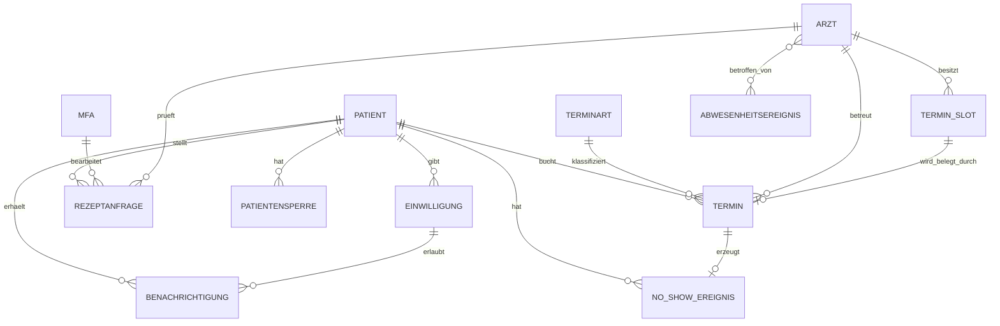

# SPEC.md – Praxis Demir & Kollegen

**Version:** v2 – umfangreiche Abgabeversion  
**Kunde:** K5 – Dr. Aylin Demir, Praxis Demir & Kollegen  
**Projekt:** Praxis-Terminsoftware mit Online-Buchung, Wiederholungsrezept-Workflow, No-Show-Tracking und DSGVO-konformer Patientenidentifikation  
**Stand:** nach Meeting 1 und Meeting 2

---

## Inhaltsverzeichnis

1. [Projektkontext und Zielbild](#1-projektkontext-und-zielbild)
2. [Scope der App](#2-scope-der-app)
3. [Entitäten](#3-entitäten)
4. [Beziehungen](#4-beziehungen)
5. [Business Rules](#5-business-rules)
6. [Widersprüche und Auflösung](#6-widersprüche-und-auflösung)
7. [Prioritäten](#7-prioritäten)
8. [Offene Fragen](#8-offene-fragen)
9. [Statusmodelle](#9-statusmodelle)
10. [Architektur-Kern](#10-architektur-kern)
11. [Rollen und Berechtigungen](#11-rollen-und-berechtigungen)
12. [Datenschutz und Datenabgrenzung](#12-datenschutz-und-datenabgrenzung)
13. [Abdeckung der Mindestanforderungen](#13-abdeckung-der-mindestanforderungen)

---

# 1. Projektkontext und Zielbild

Die Praxis **Demir & Kollegen** ist eine allgemeinmedizinische Gemeinschaftspraxis in Berlin. Sie wird von Dr. Aylin Demir gemeinsam mit zwei weiteren Ärzt:innen geführt. In der Praxis arbeiten außerdem vier MFAs. Die Praxis betreut ungefähr 2.500 Stammpatient:innen pro Quartal.

Das Hauptproblem ist der hohe Telefonaufwand bei der Terminvergabe. Besonders Routinefälle wie Vorsorge, Beratung, Impfungen und Wiederholungsrezept-Abholungen verursachen viele Anrufe, obwohl sie grundsätzlich gut online abbildbar wären. Die MFAs sind dadurch stark belastet und haben weniger Zeit für Fälle, die wirklich telefonische Einschätzung oder persönliche Betreuung benötigen.

Die App soll deshalb kein großes Krankenhaus- oder Praxisverwaltungssystem ersetzen, sondern als **Buchungs- und Verwaltungswerkzeug** funktionieren. Sie soll Routineprozesse digitalisieren, ohne medizinische Entscheidungen zu automatisieren.

## Ziel der App

Die App soll:

- telefonische Routine-Terminbuchungen reduzieren,
- Online-Terminbuchungen für geeignete Terminarten ermöglichen,
- Akutsprechstunden vor falscher Online-Buchung schützen,
- Wiederholungsrezept-Anfragen digital abbilden,
- No-Shows dokumentieren und Konsequenzen automatisch durchsetzen,
- Patienten DSGVO-konform identifizieren,
- Arztverfügbarkeiten und Praxisschließungen korrekt berücksichtigen,
- einfache Wochenübersichten für die Praxisinhaberin liefern.

## Nicht-Ziel der App

Die App soll ausdrücklich **nicht**:

- Diagnosen stellen,
- medizinische Triage-Entscheidungen treffen,
- Krankschreibungen vollautomatisch ausstellen,
- Rezepte ohne ärztliche Freigabe ausstellen,
- Laborbefunde oder Diagnosen speichern,
- das Praxisverwaltungssystem ersetzen,
- ein vollständiges Patientenportal oder KIS werden.

---

# 2. Scope der App

## 2.1 In Scope

Folgende Bereiche gehören zum Projektumfang:

1. **Online-Terminbuchung für Routinefälle**
   - Vorsorge
   - Beratung
   - Impfung
   - Wiederholungsrezept-Abholung

2. **Verwaltung von Terminarten und Slots**
   - reguläre Slots
   - Akutslots
   - gesperrte Slots
   - Arzt-Abwesenheiten
   - Praxisschließungen

3. **Akutsprechstunden-Logik**
   - Akut nicht vorausbuchbar
   - Akutslots nicht als normale Online-Termine sichtbar
   - Weiterleitung an Telefon oder 112 bei kritischen Symptomen
   - finale Einschätzung durch MFA

4. **Wiederholungsrezept-Workflow**
   - Patient stellt Anfrage
   - MFA sieht/legt Auftrag an
   - Ärztin/Arzt prüft
   - Patient wird informiert

5. **No-Show-Tracking**
   - Dokumentation
   - Warnung nach zwei No-Shows
   - Online-Sperre nach drei No-Shows

6. **Benachrichtigungen**
   - Terminänderungen
   - Arzt-Ausfall
   - Rezept bereit
   - No-Show-Warnung
   - Erinnerungen nur mit Opt-in

7. **Datenschutz und Identifikation**
   - eindeutige Patientenidentifikation bei jeder Buchung
   - keine Speicherung klinischer Daten in der App
   - Opt-in für E-Mail/SMS

8. **Einfache Auswertungen**
   - Online-Buchungsquote
   - No-Show-Rate pro Arzt
   - Akutslot-Auslastung
   - offene Rezeptanfragen
   - durchschnittliche Bearbeitungsdauer von Rezeptanfragen

## 2.2 Out of Scope

Folgende Punkte werden bewusst ausgeschlossen:

- automatische medizinische Diagnose,
- automatische Behandlungsempfehlung,
- automatische Krankschreibung ohne Arztkontakt,
- automatische Rezeptausstellung ohne ärztliche Prüfung,
- Speicherung von Diagnosen, Laborwerten, Medikamentenplänen,
- vollwertige Patientenakte,
- Abrechnung,
- detaillierte Controlling-Reports,
- automatische Umbuchung zu anderer Ärztin ohne Zustimmung des Patienten.

---

# 3. Entitäten

Die Entitäten sind in **Kernentitäten** und **erweiterte Entitäten** getrennt. Die Kernentitäten bilden das Hauptmodell der App. Die erweiterten Entitäten sind sinnvoll für eine robuste Umsetzung und zeigen zusätzliche fachliche Tiefe.

---

## 3.1 Kernentitäten

## E1 – Patient

**Beschreibung:**  
Ein Patient ist eine Person, die Termine bucht, Rezeptanfragen stellt, Benachrichtigungen erhält oder von No-Show-Regeln betroffen ist.

| Attribut | Datentyp | Pflicht? | Beschreibung |
|---|---:|---:|---|
| patient_id | UUID / Integer | Ja | Eindeutige interne ID |
| name | String | Ja | Vor- und Nachname |
| geburtsdatum | Date | Ja | Zur Identifikation |
| versichertennummer | String | Bedingt | Bei gesetzlich Versicherten |
| praxis_patientennummer | String | Bedingt | Bei Privat/Selbstzahler oder bekanntem Patienten |
| versicherungsstatus | Enum | Ja | `gesetzlich`, `privat`, `selbstzahler` |
| telefonnummer | String | Ja | Für Rückfragen und Absagen |
| email | String | Nein | Nur nutzbar mit Opt-in |
| email_opt_in | Boolean | Ja | Zustimmung zu E-Mail-Kommunikation |
| sms_opt_in | Boolean | Ja | Zustimmung zu SMS-Kommunikation |
| no_show_zaehler | Integer | Ja | Anzahl relevanter No-Shows |
| sperrstatus | Enum | Ja | `aktiv`, `gewarnt`, `online_gesperrt` |
| angelegt_am | DateTime | Ja | Erstellzeitpunkt |

**Hinweis:**  
Der Patient ist eine Kernentität, weil fast alle Prozesse mit ihm verbunden sind: Terminbuchung, Rezeptanfrage, Benachrichtigung, No-Show und Sperrung.

---

## E2 – Termin

**Beschreibung:**  
Ein Termin ist ein konkreter gebuchter Zeitraum für einen Patienten. Er entsteht online, telefonisch, intern oder als Walk-in.

| Attribut | Datentyp | Pflicht? | Beschreibung |
|---|---:|---:|---|
| termin_id | UUID / Integer | Ja | Eindeutige Termin-ID |
| patient_id | Foreign Key | Ja | Zugeordneter Patient |
| terminart_id | Foreign Key | Ja | Genau eine Terminart |
| arzt_id | Foreign Key | Bedingt | Zuständige Ärztin/Arzt, falls ärztlicher Termin |
| slot_id | Foreign Key | Ja | Zugeordneter Slot |
| datum | Date | Ja | Termindatum |
| startzeit | Time | Ja | Beginn |
| endzeit | Time | Ja | Ende |
| dauer_minuten | Integer | Ja | Geplante Dauer |
| status | Enum | Ja | Status des Termins |
| buchungsweg | Enum | Ja | `online`, `telefonisch`, `walk_in`, `intern` |
| interne_notiz | String | Nein | Nur für Praxis sichtbar |
| erstellt_am | DateTime | Ja | Erstellzeitpunkt |
| storniert_am | DateTime | Nein | Falls abgesagt |

**Statuswerte:**  
`geplant`, `wahrgenommen`, `abgesagt`, `verschoben`, `no_show`, `arzt_ausfall_betroffen`

---

## E3 – Terminart

**Beschreibung:**  
Eine Terminart beschreibt, welcher Typ von Termin gebucht wird. Sie bestimmt Dauer, Online-Buchbarkeit und Sonderregeln.

| Attribut | Datentyp | Pflicht? | Beschreibung |
|---|---:|---:|---|
| terminart_id | UUID / Integer | Ja | Eindeutige ID |
| name | String | Ja | z. B. Vorsorge, Beratung |
| default_dauer_minuten | Integer | Ja | Standarddauer |
| online_buchbar | Boolean | Ja | Ob online buchbar |
| vorausbuchbar | Boolean | Ja | Ob im Voraus buchbar |
| braucht_arzt | Boolean | Ja | Ob ärztliche Beteiligung nötig ist |
| braucht_mfa | Boolean | Ja | Ob MFA beteiligt ist |
| triage_erforderlich | Boolean | Ja | Ob menschliche Einschätzung nötig ist |
| aktiv | Boolean | Ja | Ob Terminart aktuell verfügbar ist |

**Bekannte Terminarten:**

| Terminart | Dauer | Online buchbar? | Vorausbuchbar? | Bemerkung |
|---|---:|---:|---:|---|
| Vorsorge | 20 Min. | Ja | Ja | Routinefall |
| Beratung | 15 Min. | Ja | Ja | Planbar |
| Impfung | 10–15 Min. | Ja | Ja | Häufig Reisemedizin |
| Blutabnahme | 10 Min. | Offen | Offen | MFA, noch zu klären |
| Wiederholungsrezept-Abholung | 5 Min. | Ja | Ja | Kein Arztgespräch |
| Akutsprechstunde | 10 Min. | Nein | Nein | Nur am selben Tag, MFA entscheidet |
| Erstgespräch | 30 Min. | Nein | Nein | Telefonisch vorzuklären |

---

## E4 – Ärztin / Arzt

**Beschreibung:**  
Ärzt:innen behandeln Patienten, haben eigene Kalender, geben Rezeptanfragen frei und können Patienten sperren.

| Attribut | Datentyp | Pflicht? | Beschreibung |
|---|---:|---:|---|
| arzt_id | UUID / Integer | Ja | Eindeutige ID |
| name | String | Ja | Name |
| rolle | Enum | Ja | `ärztin`, `inhaberin`, `vertretung` |
| aktiv | Boolean | Ja | Ob aktuell tätig |
| sprechzeiten | Struktur / Relation | Ja | Individuelle Sprechzeiten |
| verfuegbarkeitsstatus | Enum | Ja | `verfügbar`, `abwesend`, `teilweise_verfügbar` |
| besondere_schwerpunkte | String | Nein | z. B. Reisemedizin |

**Bekannte Ärzt:innen:**  
Dr. Demir, Dr. Yilmaz, Dr. Schäfer.

---

## E5 – MFA

**Beschreibung:**  
MFAs übernehmen den operativen Praxisalltag: Termine verwalten, Telefonbuchungen eintragen, Akutslots füllen und Rezeptanfragen vorbereiten.

| Attribut | Datentyp | Pflicht? | Beschreibung |
|---|---:|---:|---|
| mfa_id | UUID / Integer | Ja | Eindeutige ID |
| name | String | Ja | Name |
| rolle | Enum | Ja | `mfa`, `leitende_mfa` |
| aktiv | Boolean | Ja | Ob aktuell tätig |
| berechtigungsstufe | Enum | Ja | Standard oder erweitert |

**Berechtigungen:**

- MFA: Termine vergeben, verschieben, stornieren, Rezeptanfragen anlegen.
- Leitende MFA: zusätzlich Patientensperren setzen oder aufheben, sofern erlaubt.

---

## E6 – TerminSlot / Verfügbarkeitsblock

**Beschreibung:**  
Ein TerminSlot ist ein konkretes Zeitfenster im Kalender. Er kann frei, belegt, gesperrt oder als Akutslot reserviert sein.

| Attribut | Datentyp | Pflicht? | Beschreibung |
|---|---:|---:|---|
| slot_id | UUID / Integer | Ja | Eindeutige ID |
| arzt_id | Foreign Key | Bedingt | Ärztin/Arzt, falls arztbezogen |
| datum | Date | Ja | Datum |
| startzeit | Time | Ja | Beginn |
| endzeit | Time | Ja | Ende |
| slot_typ | Enum | Ja | `regulär`, `akut`, `abwesenheit`, `praxisschließung` |
| status | Enum | Ja | `frei`, `reserviert`, `belegt`, `gesperrt` |
| online_sichtbar | Boolean | Ja | Ob Patient Slot sehen darf |
| vorausbuchbar | Boolean | Ja | Ob im Voraus buchbar |
| grund | String | Nein | z. B. Urlaub, Fortbildung |

**Wichtig:**  
Akutslots dürfen nicht als normale freie Online-Slots angezeigt werden.

---

## E7 – Rezeptanfrage

**Beschreibung:**  
Eine Rezeptanfrage ist eine digitale Anfrage eines Patienten für ein Wiederholungsrezept. Sie startet einen Workflow, ersetzt aber keine ärztliche Prüfung.

| Attribut | Datentyp | Pflicht? | Beschreibung |
|---|---:|---:|---|
| rezeptanfrage_id | UUID / Integer | Ja | Eindeutige ID |
| patient_id | Foreign Key | Ja | Antragstellender Patient |
| medikament_referenz | String | Ja | Bezeichnung oder Referenz, keine vollständige Medikamentenakte |
| angefragt_am | DateTime | Ja | Zeitpunkt der Anfrage |
| status | Enum | Ja | Status des Workflows |
| fruehestens_ab | Date | Nein | Bei Intervallblockade |
| bearbeitet_durch_mfa_id | Foreign Key | Nein | Zuständige MFA |
| freigegeben_durch_arzt_id | Foreign Key | Nein | Freigebende Ärztin/Arzt |
| ablehnungsgrund | String | Nein | Falls abgelehnt/blockiert |
| benachrichtigt_am | DateTime | Nein | Zeitpunkt der Patienteninfo |

---

## E8 – Benachrichtigung

**Beschreibung:**  
Eine Benachrichtigung informiert Patienten über Terminänderungen, Erinnerungen, Rezeptstatus oder No-Show-Konsequenzen.

| Attribut | Datentyp | Pflicht? | Beschreibung |
|---|---:|---:|---|
| benachrichtigung_id | UUID / Integer | Ja | Eindeutige ID |
| patient_id | Foreign Key | Ja | Empfänger |
| bezugstyp | Enum | Ja | `termin`, `rezeptanfrage`, `no_show`, `system` |
| bezugs_id | UUID / Integer | Nein | ID des bezogenen Objekts |
| kanal | Enum | Ja | `sms`, `email`, `telefon`, `brief`, `app` |
| typ | Enum | Ja | `erinnerung`, `absage`, `rezept_bereit`, `no_show_warnung` |
| status | Enum | Ja | `geplant`, `versendet`, `zugestellt`, `fehlgeschlagen`, `nicht_erlaubt` |
| erstellt_am | DateTime | Ja | Erstellzeitpunkt |
| versendet_am | DateTime | Nein | Versandzeitpunkt |

---

## 3.2 Erweiterte Entitäten

## E9 – NoShowEreignis

**Beschreibung:**  
Dokumentiert ein Nichterscheinen ohne vorherige Meldung.

| Attribut | Datentyp | Beschreibung |
|---|---:|---|
| no_show_id | UUID / Integer | Eindeutige ID |
| patient_id | Foreign Key | Betroffener Patient |
| termin_id | Foreign Key | Betroffener Termin |
| erfasst_am | DateTime | Zeitpunkt der Erfassung |
| zaehlt_fuer_sperre | Boolean | Ob Ereignis in Sperrlogik eingeht |
| kommentar | String | Interne Notiz |

---

## E10 – Patientensperre

**Beschreibung:**  
Dokumentiert, dass ein Patient keine Online-Termine mehr buchen darf.

| Attribut | Datentyp | Beschreibung |
|---|---:|---|
| sperre_id | UUID / Integer | Eindeutige ID |
| patient_id | Foreign Key | Betroffener Patient |
| grund | Enum | `drei_no_shows`, `manuell`, `sonstiges` |
| status | Enum | `aktiv`, `aufgehoben` |
| aktiviert_am | DateTime | Zeitpunkt der Sperrung |
| aktiviert_durch | Foreign Key | Ärztin/Arzt oder leitende MFA |
| aufgehoben_am | DateTime | Optional |
| aufgehoben_durch | Foreign Key | Optional |

---

## E11 – Einwilligung

**Beschreibung:**  
Speichert die Zustimmung des Patienten zu bestimmten Kommunikationskanälen.

| Attribut | Datentyp | Beschreibung |
|---|---:|---|
| einwilligung_id | UUID / Integer | Eindeutige ID |
| patient_id | Foreign Key | Zugehöriger Patient |
| zweck | Enum | `email_erinnerung`, `sms_erinnerung`, `rezeptbenachrichtigung` |
| kanal | Enum | `email`, `sms`, `app` |
| status | Enum | `erteilt`, `widerrufen`, `nicht_erteilt` |
| erteilt_am | DateTime | Optional |
| widerrufen_am | DateTime | Optional |
| datenschutzhinweis_version | String | Version der Einwilligung |

---

## E12 – Abwesenheitsereignis / Praxisschließung

**Beschreibung:**  
Blockiert einzelne Ärzt:innen oder die ganze Praxis.

| Attribut | Datentyp | Beschreibung |
|---|---:|---|
| ereignis_id | UUID / Integer | Eindeutige ID |
| typ | Enum | `urlaub`, `krankheit`, `fortbildung`, `brückentag`, `praxis_geschlossen` |
| startdatum | DateTime | Beginn |
| enddatum | DateTime | Ende |
| betrifft_ganze_praxis | Boolean | Ja/Nein |
| grund | String | Beschreibung |
| angelegt_von | Foreign Key | Verantwortliche Person |

---

## E13 – Wochenbericht

**Beschreibung:**  
Einfache Auswertung für die Praxisinhaberin.

| Attribut | Datentyp | Beschreibung |
|---|---:|---|
| bericht_id | UUID / Integer | Eindeutige ID |
| kalenderwoche | Integer | KW |
| jahr | Integer | Jahr |
| online_buchungsquote | Decimal | Anteil Online-Buchungen |
| no_show_rate_pro_arzt | Struktur | No-Shows je Arzt |
| akutslot_auslastung | Decimal | Auslastung Akutslots |
| offene_rezeptanfragen | Integer | Anzahl offener Anfragen |
| durchschnittliche_liegezeit_rezepte | Decimal | Durchschnittliche Bearbeitungsdauer |

---

## E14 – SyncEreignis

**Beschreibung:**  
Dokumentiert Synchronisationsvorgänge mit dem Praxisverwaltungssystem.

| Attribut | Datentyp | Beschreibung |
|---|---:|---|
| sync_id | UUID / Integer | Eindeutige ID |
| objekt_typ | Enum | `termin`, `patientidentifikation`, `arztverfügbarkeit`, `praxisschließung` |
| objekt_id | UUID / Integer | Betroffenes Objekt |
| richtung | Enum | `app_zu_pvs`, `pvs_zu_app`, `bidirektional` |
| status | Enum | `erfolgreich`, `fehlgeschlagen`, `wartend` |
| fehlermeldung | String | Optional |
| synchronisiert_am | DateTime | Zeitpunkt |

---

# 4. Beziehungen

## 4.1 Kernbeziehungen

## B1 – Patient hat Termine

**Kardinalität:** Patient `1:n` Termin

Ein Patient kann viele Termine haben. Ein Termin gehört genau einem Patienten.

**Pflicht/optional:**

- Patient kann 0 bis n Termine haben.
- Termin muss genau einem Patienten zugeordnet sein.

---

## B2 – Termin hat genau eine Terminart

**Kardinalität:** Terminart `1:n` Termin

Eine Terminart kann in vielen Terminen vorkommen. Ein Termin besitzt genau eine Terminart.

**Wichtige Entscheidung:**  
Mehrere Anliegen in einer Buchung werden nicht unterstützt. Wenn ein Patient Impfung und Rezeptanfrage hat, sind das zwei getrennte Vorgänge.

---

## B3 – Ärztin/Arzt betreut Termine

**Kardinalität:** Ärztin/Arzt `1:n` Termin

Eine Ärztin kann viele Termine betreuen. Ein ärztlicher Termin gehört genau einer Ärztin.

**Sonderfall:**  
Blutabnahme kann ggf. ohne Ärztin über MFA laufen. Diese Online-Buchbarkeit ist noch offen.

---

## B4 – Ärztin/Arzt besitzt Slots

**Kardinalität:** Ärztin/Arzt `1:n` TerminSlot

Eine Ärztin hat viele Slots. Ein arztbezogener Slot gehört genau einer Ärztin.

---

## B5 – Slot wird durch Termin belegt

**Kardinalität:** TerminSlot `0:1` Termin

Ein Slot ist entweder frei oder durch genau einen Termin belegt. Ein Termin belegt genau einen Slot.

---

## B6 – Patient stellt Rezeptanfragen

**Kardinalität:** Patient `1:n` Rezeptanfrage

Ein Patient kann viele Rezeptanfragen stellen. Eine Rezeptanfrage gehört genau einem Patienten.

---

## B7 – MFA bearbeitet Rezeptanfragen

**Kardinalität:** MFA `1:n` Rezeptanfrage

Eine MFA kann viele Rezeptanfragen organisatorisch vorbereiten. Eine Rezeptanfrage kann von einer MFA bearbeitet werden.

---

## B8 – Ärztin/Arzt prüft Rezeptanfragen

**Kardinalität:** Ärztin/Arzt `1:n` Rezeptanfrage

Eine Ärztin kann viele Rezeptanfragen freigeben oder ablehnen. Eine Rezeptanfrage braucht eine ärztliche Prüfung.

---

## B9 – Patient erhält Benachrichtigungen

**Kardinalität:** Patient `1:n` Benachrichtigung

Ein Patient kann viele Benachrichtigungen erhalten. Eine Benachrichtigung gehört genau einem Patienten.

---

## 4.2 Erweiterte Beziehungen

## B10 – Abwesenheitsereignis betrifft Ärzt:innen

**Kardinalität:** Abwesenheitsereignis `n:m` Ärztin/Arzt

Ein Abwesenheitsereignis kann eine oder mehrere Ärzt:innen betreffen. Eine Ärztin kann über die Zeit viele Abwesenheitsereignisse haben.

**Beispiel:**

- Dr. Demir hat Urlaub → nur ihre Slots gesperrt.
- Alle Ärzt:innen sind auf Fortbildung → ganze Praxis gesperrt.

**Verbindungstabelle:** `ereignis_betroffene_aerzte`

| Attribut | Datentyp |
|---|---:|
| ereignis_id | Foreign Key |
| arzt_id | Foreign Key |
| kommentar | String |

---

## B11 – Termin erzeugt NoShowEreignis

**Kardinalität:** Termin `0:1` NoShowEreignis

Ein Termin kann ohne No-Show enden oder genau ein NoShowEreignis erzeugen.

---

## B12 – Patient hat NoShowEreignisse

**Kardinalität:** Patient `1:n` NoShowEreignis

Ein Patient kann mehrere NoShowEreignisse haben. Ein NoShowEreignis gehört genau einem Patienten.

---

## B13 – Patient kann gesperrt werden

**Kardinalität:** Patient `1:n` Patientensperre

Ein Patient kann historisch mehrere Sperren haben. Aktiv soll maximal eine Sperre gleichzeitig sein.

---

## B14 – Patient gibt Einwilligungen

**Kardinalität:** Patient `1:n` Einwilligung

Ein Patient kann mehrere Einwilligungen haben, z. B. für E-Mail und SMS.

---

## B15 – Einwilligung erlaubt Benachrichtigungen

**Kardinalität:** Einwilligung `1:n` Benachrichtigung

Eine Einwilligung kann Grundlage für viele Benachrichtigungen sein. Ohne aktive Einwilligung dürfen E-Mail/SMS nicht versendet werden.

---

## B16 – SyncEreignis dokumentiert App-PVS-Austausch

**Kardinalität:** SyncEreignis `n:1` Objekt

Ein SyncEreignis bezieht sich auf ein synchronisiertes Objekt, z. B. Termin, Patientidentifikation oder Arztverfügbarkeit.

---

## 4.3 ER-Übersicht als Mermaid-Diagramm



---

# 5. Business Rules

Die Business Rules sind im Format **„Wenn A, dann B“** formuliert.

## 5.1 Wichtigste Business Rules für die Abgabe

## BR-01 – Online-Buchung für Routinefälle

**Wenn** ein Patient einen Routine-Termin wie Vorsorge, Beratung, Impfung oder Wiederholungsrezept-Abholung buchen möchte,  
**dann** darf die App passende Online-Slots anbieten, sofern Arztverfügbarkeit und Praxisschließungen dies erlauben.

---

## BR-02 – Akuttermine nicht online buchbar

**Wenn** ein Patient einen Akuttermin auswählt,  
**dann** darf die App keinen normalen Online-Termin anbieten, sondern verweist auf telefonische Kontaktaufnahme mit der Praxis.

---

## BR-03 – Kritische Symptome

**Wenn** ein Patient Symptome wie Brustschmerzen, hohes Fieber oder starke Atemnot angibt,  
**dann** darf die App keinen Slot anbieten, sondern muss zum Anruf in der Praxis oder zum Notruf 112 auffordern.

---

## BR-04 – Akutslots verstecken

**Wenn** ein Slot für die Akutsprechstunde reserviert ist,  
**dann** darf er nicht als normaler freier Online-Termin angezeigt werden.

---

## BR-05 – Wiederholungsrezepte nur mit ärztlicher Freigabe

**Wenn** ein Patient ein Wiederholungsrezept anfragt,  
**dann** darf die App den Workflow starten, aber das Rezept erst nach ärztlicher Freigabe freigeben.

---

## BR-06 – Rezeptintervall prüfen

**Wenn** das notwendige Wiederholungsintervall noch nicht erreicht ist,  
**dann** blockiert die App die Anfrage organisatorisch und zeigt an, ab welchem Datum eine erneute Anfrage möglich ist.

---

## BR-07 – DSGVO-konforme Identifikation

**Wenn** ein Patient online bucht,  
**dann** muss er eindeutig identifiziert werden, z. B. durch Name, Geburtsdatum, Versichertennummer oder Patientennummer und Telefonnummer.

---

## BR-08 – Opt-in für E-Mail/SMS

**Wenn** ein Patient keine ausdrückliche Zustimmung zu E-Mail oder SMS gegeben hat,  
**dann** darf die App keine Erinnerungen oder Benachrichtigungen über diesen Kanal versenden.

---

## BR-09 – No-Show-Warnung

**Wenn** ein Patient innerhalb von zwölf Monaten zweimal ohne Absage nicht erscheint,  
**dann** erhält er automatisch eine schriftliche Warnung oder Erinnerung.

---

## BR-10 – Online-Sperre nach drei No-Shows

**Wenn** ein Patient innerhalb des relevanten Zeitraums dreimal ohne Absage nicht erscheint,  
**dann** wird seine Online-Buchung gesperrt und er darf Termine nur noch telefonisch vereinbaren.

---

## 5.2 Weitere Business Rules

## BR-11 – Erstgespräch telefonisch

**Wenn** ein neuer Patient ein Erstgespräch benötigt,  
**dann** muss dieses telefonisch durch eine MFA vorgeklärt werden.

---

## BR-12 – Neue Patienten nicht direkt online buchen

**Wenn** ein Patient noch nicht in der Praxis bekannt ist,  
**dann** darf er nicht direkt einen regulären Online-Termin buchen, sondern muss zuerst telefonisch aufgenommen werden.

---

## BR-13 – Ein Termin, eine Terminart

**Wenn** ein Patient mehrere Anliegen hat,  
**dann** muss die App getrennte Vorgänge verwenden und darf keine kombinierte Mehrfach-Terminart buchen.

---

## BR-14 – Impfung und Rezept getrennt

**Wenn** ein Patient z. B. Impfung und Rezeptanfrage hat,  
**dann** bucht er die Impfung als Termin und stellt die Rezeptanfrage separat.

---

## BR-15 – Arzt-Abwesenheit

**Wenn** eine Ärztin abwesend ist,  
**dann** dürfen ihre Slots nicht online buchbar sein.

---

## BR-16 – Praxisschließung

**Wenn** die gesamte Praxis geschlossen ist,  
**dann** dürfen keine Termine bei irgendeiner Ärztin angeboten werden.

---

## BR-17 – Einzelurlaub blockiert nur betroffene Ärztin

**Wenn** nur eine Ärztin Urlaub hat,  
**dann** dürfen nur ihre Slots blockiert werden, nicht die Slots der Kolleg:innen.

---

## BR-18 – Gemeinsame Fortbildung blockiert alle

**Wenn** alle Ärzt:innen auf gemeinsamer Fortbildung sind,  
**dann** muss die App die gesamte Praxis als geschlossen behandeln.

---

## BR-19 – Arzt-Ausfall informieren

**Wenn** eine Ärztin kurzfristig ausfällt,  
**dann** müssen alle betroffenen Patienten informiert werden.

---

## BR-20 – Alternativtermine nur vorschlagen

**Wenn** eine Ärztin kurzfristig ausfällt,  
**dann** darf die App alternative freie Termine vorschlagen, aber nicht automatisch umbuchen.

---

## BR-21 – Absage zählt nicht automatisch als No-Show

**Wenn** ein Patient vor dem Termin absagt,  
**dann** zählt dies nicht als No-Show, solange der Slot noch neu vergeben werden kann.

---

## BR-22 – No-Show-Definition

**Wenn** ein Patient nicht erscheint und sich vorher gar nicht meldet,  
**dann** gilt der Termin als No-Show.

---

## BR-23 – Keine klinischen Daten in der App

**Wenn** Daten Diagnosen, Laborbefunde oder vollständige Medikamentenpläne betreffen,  
**dann** dürfen sie nicht in der App gespeichert werden.

---

## BR-24 – Synchronisation mit PVS

**Wenn** Daten Termine, Patientenidentifikation, Arztverfügbarkeit oder Praxisschließungen betreffen,  
**dann** müssen sie zwischen App und Praxisverwaltungssystem synchronisiert werden.

---

## BR-25 – Interne Notizen verborgen

**Wenn** eine interne Notiz zu einem Patienten oder Termin gespeichert wird,  
**dann** darf sie für den Patienten nicht sichtbar sein.

---

## BR-26 – MFA-Rechte

**Wenn** eine MFA reguläre Termine verwaltet,  
**dann** darf sie Termine vergeben, verschieben und stornieren.

---

## BR-27 – Sperrrechte

**Wenn** ein Patient gesperrt werden soll,  
**dann** dürfen das nur Ärzt:innen oder die leitende MFA.

---

## BR-28 – Wochenübersicht

**Wenn** ein Wochenbericht erstellt wird,  
**dann** soll er Online-Buchungsquote, No-Show-Rate pro Arzt, Akutslot-Auslastung, offene Rezeptanfragen und durchschnittliche Rezept-Liegezeit enthalten.

---

## BR-29 – Kein großes Dashboard

**Wenn** Auswertungen bereitgestellt werden,  
**dann** sollen sie als einfache Wochenübersicht dargestellt werden und keine stundenlangen Detailreports erzeugen.

---

## BR-30 – Krankschreibung nicht automatisieren

**Wenn** ein Patient eine Krankschreibung möchte,  
**dann** darf diese nicht vollständig online ohne Arztkontakt ausgestellt werden.

---

# 6. Widersprüche und Auflösung

## W1 – Online-Buchung vs. Telefon bleibt bestehen

**Aussage A:**  
Die Terminvergabe soll online gehen, weil Telefonanfragen die MFAs stark belasten.

**Aussage B:**  
Viele ältere oder technikferne Patienten werden weiterhin telefonisch buchen.

**Widerspruch:**  
Online-Buchung klingt zunächst wie Ersatz des Telefons. Tatsächlich bleibt das Telefon aber dauerhaft notwendig.

**Auflösung:**  
Die App ersetzt das Telefon nicht vollständig, sondern ergänzt es. Ziel ist eine deutliche Entlastung der MFAs, nicht die komplette Abschaffung telefonischer Buchungen. Telefon bleibt für ältere Patienten, Akutfälle, neue Patienten und komplexe Sonderfälle bestehen.

**Modellentscheidung:**  
Beim Termin wird der `buchungsweg` gespeichert: `online`, `telefonisch`, `walk_in`, `intern`.

---

## W2 – Akut-Vorfilterung vs. medizinische Entscheidung

**Aussage A:**  
Die App soll Akutanfragen vorsortieren, damit Routinefälle nicht die Akutsprechstunde blockieren.

**Aussage B:**  
Die finale Entscheidung über Dringlichkeit trifft immer eine MFA, nicht die App.

**Widerspruch:**  
Vorfilterung könnte wie eine medizinische Entscheidung wirken.

**Auflösung:**  
Die App trifft keine medizinische Entscheidung. Sie steuert nur den Buchungsweg. Bei Akut oder kritischen Symptomen wird kein Termin angeboten, sondern auf Telefonkontakt oder 112 verwiesen.

**Modellentscheidung:**  
Akutlogik wird als Buchungsweg-Steuerung modelliert, nicht als Diagnosefunktion.

---

## W3 – Digitalisierung vs. ärztliche Rezeptfreigabe

**Aussage A:**  
Wiederholungsrezepte sollen online angefragt werden können, um Telefonstress zu reduzieren.

**Aussage B:**  
Ein Rezept darf niemals automatisch ohne ärztliche Prüfung freigegeben werden.

**Widerspruch:**  
Digitale Rezeptanfrage könnte fälschlich als automatische Rezeptausstellung verstanden werden.

**Auflösung:**  
Die App digitalisiert nur den Workflow. Sie nimmt Anfragen entgegen, zeigt sie der MFA/Ärztin an und benachrichtigt den Patienten. Die ärztliche Freigabe bleibt verpflichtend.

**Modellentscheidung:**  
Rezeptanfrage erhält ein Statusmodell mit `in_ärztlicher_prüfung`, `freigegeben` und `abgelehnt`.

---

## W4 – Arzt-Ausfall: Umbuchung vs. Patientenwahl

**Aussage A:**  
Bei Arzt-Ausfall soll die App Patienten informieren und Umbuchung erleichtern.

**Aussage B:**  
Nicht jeder Patient möchte automatisch zu einer anderen Ärztin umgebucht werden.

**Widerspruch:**  
Automatische Umbuchung wäre effizient, könnte aber Patientenwünsche ignorieren.

**Auflösung:**  
Die App informiert verpflichtend und darf Alternativtermine vorschlagen. Sie darf aber nicht automatisch umbuchen.

**Modellentscheidung:**  
Alternativtermine werden als Vorschläge angezeigt. Die Entscheidung liegt beim Patienten.

---

## W5 – PVS-Anbindung vs. keine Gesundheitsdaten in App

**Aussage A:**  
Die App muss mit dem Praxisverwaltungssystem zusammenarbeiten.

**Aussage B:**  
Diagnosen, Medikamentenpläne und Laborbefunde dürfen nicht in der App gespeichert werden.

**Widerspruch:**  
Eine Schnittstelle könnte dazu führen, dass zu viele medizinische Daten übertragen werden.

**Auflösung:**  
Es werden nur Verwaltungsdaten synchronisiert: Termine, Patientenidentifikation, Arztverfügbarkeit und Praxisschließungen. Klinische Daten bleiben im PVS.

**Modellentscheidung:**  
Die App ist ein Buchungskanal, kein zweites KIS.

---

## W6 – Mehrere Anliegen vs. einfache Planung

**Aussage A:**  
Patienten haben oft mehrere Anliegen gleichzeitig.

**Aussage B:**  
Kombinierte Buchungen erzeugen Planungschaos.

**Widerspruch:**  
Mehrere Anliegen in einem Termin wären komfortabel, aber schwer planbar.

**Auflösung:**  
Ein Termin hat genau eine Terminart. Weitere Anliegen werden als separate Vorgänge abgebildet.

**Modellentscheidung:**  
Keine n:m-Beziehung zwischen Termin und Terminart. Stattdessen: Terminart `1:n` Termin.

---

## W7 – Absage vs. No-Show-Frist

**Aussage A:**  
Eine Absage zählt nicht als No-Show, solange die MFA den Slot neu vergeben kann.

**Aussage B:**  
Eine Absage eine Stunde vorher ist praktisch oft zu spät.

**Widerspruch:**  
Es gibt noch keine offizielle feste Frist.

**Auflösung:**  
Aktuell gilt nur Nichterscheinen ohne Meldung als No-Show. Eine 2-Stunden-Grenze wird als sinnvoller Vorschlag dokumentiert, ist aber noch offen.

**Modellentscheidung:**  
Absagefrist wird als offener Parameter geführt.

---

# 7. Prioritäten

## 7.1 Must Have – V1 zwingend

## P1 – Online-Terminbuchung mit korrekter Arztverfügbarkeit

Die App muss Routine-Terminbuchungen online ermöglichen und dabei Arztkalender, individuelle Sprechzeiten, Abwesenheiten und Praxisschließungen berücksichtigen.

**Begründung:**  
Das ist das Kernproblem: Telefonstress reduzieren.

---

## P2 – Wiederholungsrezept-Workflow

Die App muss Rezeptanfragen digital entgegennehmen, intern sichtbar machen, ärztliche Freigabe ermöglichen und Patienten benachrichtigen.

**Begründung:**  
Wiederholungsrezepte verursachen viele Telefonkontakte und sind ein wiederkehrender Verwaltungsprozess.

---

## P3 – DSGVO-konforme Patientenidentifikation

Die App muss Patienten bei jeder Buchung eindeutig identifizieren.

**Begründung:**  
Ohne sichere Identifikation entstehen Datenschutz- und Fehlbuchungsrisiken.

---

## P4 – Akutslots korrekt schützen

Akutslots dürfen nicht online durch Routinefälle blockiert werden.

**Begründung:**  
Sonst würde die App ein Kernproblem verschlimmern.

---

## P5 – No-Show-Tracking mit Konsequenzen

No-Shows müssen nicht nur ausgewertet, sondern mit Warnung und Sperre verbunden werden.

**Begründung:**  
Dr. Demir betont, dass reine Statistik nicht reicht.

---

## 7.2 Should Have

- automatische Benachrichtigungen bei Terminänderung und Rezeptfreigabe,
- alternative Terminvorschläge bei Arzt-Ausfall,
- einfache Wochenübersicht,
- Opt-in-Verwaltung für SMS/E-Mail,
- Patient kann Termin online absagen oder umbuchen.

---

## 7.3 Could Have

- Warteliste für frei gewordene Termine,
- Patientenpräferenzen für bestimmte Ärzt:innen,
- erweiterte Auswertungen,
- Dashboard für MFA-Team,
- automatische Vorlagen für No-Show-Briefe.

---

## 7.4 Won't Have / bewusst ausgeschlossen

- vollautomatische Krankschreibungen,
- vollautomatische Rezeptausstellung,
- Speicherung klinischer Diagnosen,
- Laborbefundverwaltung,
- Abrechnungsfunktionen,
- automatische Umbuchung zu anderer Ärztin,
- kombinierte Mehrfach-Terminarten.

---

# 8. Offene Fragen

## O1 – No-Show-Frist

Eine 2-Stunden-Frist wurde als sinnvoll genannt, ist aber noch nicht offiziell beschlossen.

**Offen:**  
Gilt eine Absage unter 2 Stunden vor Termin als späte Absage oder No-Show?

---

## O2 – Blutabnahme online buchbar?

Blutabnahme läuft über MFA und braucht keinen Arzt, aber Dr. Demir war unsicher, ob sie online buchbar sein soll.

**Offen:**  
Soll Blutabnahme online buchbar sein oder nur telefonisch/intern vergeben werden?

---

## O3 – Stärke der Authentifizierung

Pflichtdaten sind geklärt, aber nicht der technische Sicherheitsmechanismus.

**Offen:**  
Reichen Name, Geburtsdatum und Versichertennummer/Patientennummer oder braucht es zusätzlich SMS-Code?

---

## O4 – Technische PVS-Schnittstelle

Inhaltlich ist klar, welche Daten synchronisiert werden. Technisch ist unklar, welche Schnittstelle existiert.

**Offen:**  
API, CSV-Import, manuelle Synchronisation oder Anbieter-Schnittstelle?

---

## O5 – Rezeptabholung oder Apothekenübermittlung

Es wurde erwähnt, dass Rezepte abgeholt oder direkt zur Apotheke geschickt werden können.

**Offen:**  
Soll der Patient in der App eine Apotheke auswählen können?

---

## O6 – Aufhebung der Online-Sperre

Die Sperre nach drei No-Shows ist geklärt, aber nicht deren Aufhebung.

**Offen:**  
Wird die Sperre automatisch nach Zeitablauf aufgehoben oder nur manuell?

---

## O7 – Audit-Log

Kritische Aktionen sind datenschutzrelevant.

**Offen:**  
Welche Aktionen müssen revisionssicher protokolliert werden?

---

# 9. Statusmodelle

## 9.1 Terminstatus

```text
geplant
  ├── wahrgenommen
  ├── abgesagt
  ├── verschoben
  ├── no_show
  └── arzt_ausfall_betroffen → patient_informiert → umgebucht / abgesagt
```

| Status | Bedeutung |
|---|---|
| geplant | Termin wurde gebucht |
| wahrgenommen | Patient ist erschienen |
| abgesagt | Termin wurde abgesagt |
| verschoben | Termin wurde auf anderen Slot gelegt |
| no_show | Patient ist ohne Meldung nicht erschienen |
| arzt_ausfall_betroffen | Termin ist durch Arzt-Ausfall betroffen |

---

## 9.2 Slotstatus

```text
frei → reserviert → belegt
frei → gesperrt
akut_gesperrt → akut_freigegeben → belegt
```

| Status | Bedeutung |
|---|---|
| frei | Slot ist buchbar |
| reserviert | Kurzzeitig während Buchung blockiert |
| belegt | Termin wurde gebucht |
| gesperrt | Nicht buchbar |
| akut_gesperrt | Akutslot existiert, ist aber nicht online sichtbar |
| akut_freigegeben | Akutslot ist am selben Tag intern nutzbar |

---

## 9.3 Rezeptanfrage-Status

```text
eingereicht
  ├── automatisch_blockiert_wegen_intervall
  └── organisatorisch_geprüft
        ↓
     in_ärztlicher_prüfung
        ├── freigegeben → patient_benachrichtigt → erledigt
        └── abgelehnt → patient_benachrichtigt
```

| Status | Bedeutung |
|---|---|
| eingereicht | Patient hat Anfrage gestellt |
| automatisch_blockiert_wegen_intervall | Anfrage zu früh |
| organisatorisch_geprüft | MFA hat Anfrage vorbereitet |
| in_ärztlicher_prüfung | Ärztin/Arzt prüft |
| freigegeben | Rezept wurde freigegeben |
| abgelehnt | Rezept wurde nicht freigegeben |
| patient_benachrichtigt | Patient wurde informiert |
| erledigt | Vorgang abgeschlossen |

---

## 9.4 Patient / No-Show-Status

```text
aktiv
  ↓ 1. No-Show
aktiv_mit_no_show
  ↓ 2. No-Shows innerhalb 12 Monaten
gewarnt
  ↓ 3. No-Shows
online_gesperrt
```

| Status | Bedeutung |
|---|---|
| aktiv | Patient darf online buchen |
| aktiv_mit_no_show | Patient hat einen No-Show |
| gewarnt | Patient wurde schriftlich erinnert |
| online_gesperrt | Patient darf nur noch telefonisch buchen |

---

## 9.5 Benachrichtigungsstatus

```text
geplant → versendet → zugestellt
                  └── fehlgeschlagen
```

| Status | Bedeutung |
|---|---|
| geplant | Nachricht wurde erzeugt |
| versendet | Nachricht wurde gesendet |
| zugestellt | Zustellung erfolgreich |
| fehlgeschlagen | Zustellung nicht erfolgreich |
| nicht_erlaubt | Kein Opt-in vorhanden |

---

# 10. Architektur-Kern

## 10.1 Hauptkomponenten

## Patientenseite

Funktionen:

- Terminart auswählen,
- Ärztin auswählen,
- freien Slot auswählen,
- Termin buchen,
- Rezeptanfrage stellen,
- Benachrichtigungen erhalten,
- Termin absagen oder umbuchen,
- Einwilligungen verwalten.

---

## MFA-Oberfläche

Funktionen:

- Telefonbuchungen eintragen,
- Termine verwalten,
- Walk-ins erfassen,
- Akutslots vergeben,
- Rezeptanfragen vorbereiten,
- No-Shows dokumentieren,
- Patienteninformationen prüfen,
- Benachrichtigungen auslösen oder überwachen.

---

## Ärzt:innen-Oberfläche

Funktionen:

- eigene Termine sehen,
- Verfügbarkeit prüfen,
- Rezeptanfragen freigeben oder ablehnen,
- Patienten sperren oder Sperren aufheben,
- No-Show-Entwicklung einsehen.

---

## Backend / Domänenlogik

Module:

| Modul | Aufgabe |
|---|---|
| Buchungsmodul | Terminbuchung, Terminarten, Slots |
| Verfügbarkeitsmodul | Arztkalender, Urlaub, Praxisschließungen |
| Akutmodul | Akutslots und Buchungsweg-Steuerung |
| Rezeptmodul | Wiederholungsrezept-Workflow |
| No-Show-Modul | Zählung, Warnung, Sperre |
| Benachrichtigungsmodul | Nachrichten und Erinnerungen |
| Consent-Modul | Einwilligungen |
| Reporting-Modul | Wochenübersicht |
| Rollenmodul | Berechtigungen |
| Sync-Modul | Austausch mit Praxisverwaltungssystem |

---

## 10.2 App-Datenbank

Die App speichert:

- Patientidentifikation für Buchungen,
- Termine,
- Terminarten,
- Slots,
- Rezeptanfragen,
- No-Show-Ereignisse,
- Sperrstatus,
- Einwilligungen,
- Benachrichtigungsstatus,
- Sync-Protokolle,
- Wochenberichte.

Die App speichert nicht:

- Diagnosen,
- Laborbefunde,
- klinische Arztbriefe,
- vollständige Medikamentenpläne,
- Abrechnungsdaten,
- komplette Patientenakte.

---

## 10.3 Praxisverwaltungssystem

Das Praxisverwaltungssystem bleibt führend für:

- Patientenakte,
- Abrechnung,
- Diagnosen,
- Medikamentenpläne,
- Laborbefunde,
- klinische Dokumentation.

Zwischen App und PVS werden synchronisiert:

- Termine,
- Patientenidentifikation,
- Arztverfügbarkeit,
- Praxisschließungen.

---

# 11. Rollen und Berechtigungen

| Rolle | Darf tun | Darf nicht tun |
|---|---|---|
| Patient | Termine buchen, Rezeptanfragen stellen, Einwilligung geben, Termine absagen | interne Notizen sehen, medizinische Daten ändern |
| MFA | Termine vergeben/verschieben/stornieren, Akutslots füllen, Rezeptanfragen vorbereiten, No-Shows erfassen | Rezepte medizinisch freigeben, Diagnosen ändern |
| Leitende MFA | zusätzlich Patienten sperren/entsperren | medizinische Rezeptfreigabe ersetzen |
| Ärztin/Arzt | Rezepte freigeben/ablehnen, Patienten sperren, eigene Verfügbarkeit prüfen | ohne Patienteneinwilligung Nachrichtenkanäle nutzen |
| System | Regeln prüfen, Benachrichtigungen erzeugen, Slots filtern | medizinische Entscheidungen treffen |

---

# 12. Datenschutz und Datenabgrenzung

## 12.1 Grundsätze

Die App folgt diesen Grundsätzen:

- Datensparsamkeit,
- Zweckbindung,
- rollenbasierter Zugriff,
- keine klinischen Daten in der App,
- Opt-in für SMS/E-Mail,
- Trennung zwischen Verwaltungsdaten und Gesundheitsdaten,
- interne Notizen nicht für Patienten sichtbar,
- DSGVO-konforme Identifikation bei jeder Buchung.

## 12.2 Zulässige Daten in der App

- Name,
- Geburtsdatum,
- Versichertennummer oder Patientennummer,
- Versicherungsstatus,
- Telefonnummer,
- E-Mail mit Opt-in,
- Termine,
- Terminstatus,
- Buchungsweg,
- No-Show-Zähler,
- Sperrstatus,
- Rezeptanfrage-Status,
- Benachrichtigungsstatus.

## 12.3 Nicht zulässige Daten in der App

- Diagnosen,
- Laborbefunde,
- vollständige Medikamentenpläne,
- klinische Arztbriefe,
- Behandlungsdokumentation,
- Abrechnungsdaten.

## 12.4 Kritische Datenschutzregeln

- Ohne Opt-in keine E-Mail oder SMS.
- Interne Notizen sind nie patientensichtbar.
- Gesundheitsdaten bleiben im PVS.
- Jede Buchung erfordert eindeutige Identifikation.
- Rezeptfreigaben sind ärztliche Entscheidungen und müssen nachvollziehbar bleiben.

---

# 13. Abdeckung der Mindestanforderungen

| Bereich | Mindestanforderung | In dieser SPEC | Bewertung |
|---|---:|---:|---|
| Entitäten | 6–8 | 8 Kernentitäten + 6 erweiterte | erfüllt und erweitert |
| Beziehungen | 6–9 | 9 Kernbeziehungen + 7 erweiterte | erfüllt und erweitert |
| n:m-Beziehung | mindestens 1 | Abwesenheitsereignis ↔ Ärzt:innen | erfüllt |
| Business Rules | 4–5 | 30 Regeln | deutlich erfüllt |
| Widersprüche | ca. 2 | 7 erkannt und aufgelöst | deutlich erfüllt |
| Prioritäten | empfohlen | Must/Should/Could/Won't | erfüllt |
| Offene Fragen | empfohlen | 7 offene Fragen | erfüllt |
| Statusmodelle | Zusatz | 5 Statusmodelle | erweitert |
| Architektur-Kern | Zusatz | vorhanden | erweitert |

## Fazit

Diese SPEC erfüllt die Mindestanforderungen deutlich und geht darüber hinaus. Sie enthält ein vollständiges Anforderungsmodell mit Kern- und Erweiterungsentitäten, klaren Kardinalitäten, einer n:m-Beziehung, konkreten Business Rules, aufgelösten Widersprüchen, Prioritäten, offenen Fragen, Statusmodellen und einem Architektur-Kern für die spätere App-Umsetzung.
